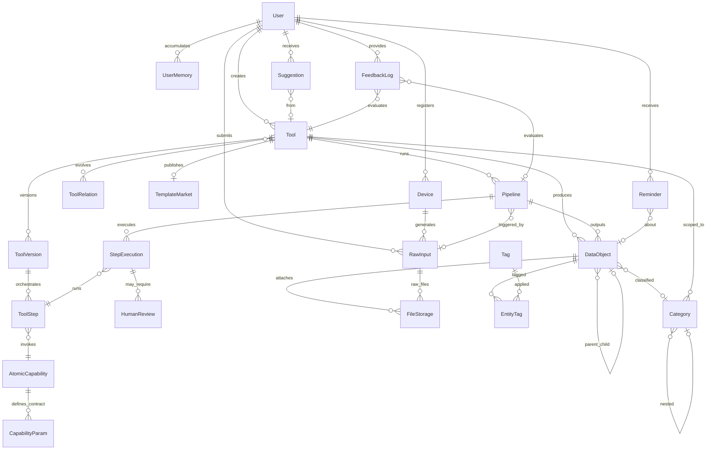

# Lifly — 数据架构设计

> Version: 0.4 | Date: 2026-03-09 | Status: Draft
>
> 本文档为架构层设计，定义域结构、实体关系与关键设计决策。字段级详细设计由工程师在实施阶段输出。

---

## 1. 设计约束

源自 PRD 的核心约束，直接影响数据架构选型：

| 约束 | 架构影响 |
|------|----------|
| 意图驱动，工具由 LLM 动态生成 | 不能为每个场景建专用表 → 需要 Schema-flexible 的通用数据容器 |
| 数据与记忆存本地，推理可远程 | 存储层完全自托管；原子能力需区分 local / remote 运行时 |
| 能力可演化、可共享 | 工具需要版本管理、谱系追踪、去隐私化快照 |
| 多模态数据采集 | 文件与元数据必须分离；需统一接入层 |
| 跨工具语义检索 | 所有业务数据需共享向量空间 |

---

## 2. 域架构

系统数据模型划分为**四个域 + 一个横切关注点**，非线性分层。

### 2.1 总览

```
        User · Device ── 横切（身份与接入）
 ═══════════════════════════════════════════
  ┌──────────────┐         ┌──────────────┐
  │     Tool     │◄────────│ Intelligence │
  │   组装·执行   │         │  记忆·演化    │
  └───┬──────┬───┘         └──┬───────┬───┘
      │      │                │       │
 ─────┼──────┼────────────────┼───────┼────
      │      │                │       │
      ▼      ▼                ▼       ▼
  ┌──────────────┐         ┌──────────────┐
  │  Capability  │         │     Data     │
  │  原子能力注册  │         │  业务数据容器  │
  └──────────────┘         └──────────────┘
```

### 2.2 域职责

| 域 | 职责 | 存什么 | 核心实体 |
|----|------|--------|----------|
| **横切 · Identity** | 身份与接入：谁、从哪个设备 | 身份凭证、设备注册 | User, Device |
| **Capability** | 原子能力注册：系统能做什么 | 能力定义、参数契约 | AtomicCapability, CapabilityParam |
| **Data** | 业务数据存储：产出了什么 | 通用数据容器、文件、标签、分类 | DataObject, FileStorage, Tag, Category, EntityTag |
| **Tool** | 能力组装与执行：怎么做 | 工具定义、版本、编排、执行记录 | Tool, ToolVersion, ToolStep, ToolRelation, TemplateMarket, RawInput, Pipeline, StepExecution, HumanReview |
| **Intelligence** | 智能输出：怎么变聪明 | 记忆、建议、提醒、反馈 | UserMemory, Reminder, Suggestion, FeedbackLog |

### 2.3 依赖规则

```
Intelligence ──→ Tool, Data, Capability
Tool ──→ Capability, Data
Data ──→ (无)
Capability ──→ (无)
User/Device ··→ 横切，所有域可引用
```

| 规则 | 说明 |
|------|------|
| Foundation 域互相独立 | Capability 和 Data 之间无依赖 |
| Consumer 域依赖 Foundation | Tool 和 Intelligence 都可引用 Capability 和 Data |
| Intelligence → Tool | Intelligence 可构造/演化工具，但 Tool 不引用 Intelligence |
| 横切可被所有域引用 | User/Device 是身份分区键，不属于任何业务域 |
| Data 上的 tool_id 是归属标记 | DataObject.tool_id、Category.tool_id 是查询便利的 FK，非结构性依赖。Data 域不依赖 Tool 域即可独立运作 |

---

## 3. 实体关系总览



---

## 4. 各域实体说明

### 4.1 横切 · Identity

| 实体 | 说明 | 关键属性 |
|------|------|----------|
| **User** | 系统所有者。单用户为主，预留多用户 | 认证信息、偏好设置 |
| **Device** | 已注册的终端。四类：web / desktop / mobile / plugin | 类型、平台、令牌、活跃状态 |

### 4.2 Capability 域

| 实体 | 说明 | 关键属性 |
|------|------|----------|
| **AtomicCapability** | 最小不可分的功能单元，无业务语义 | 名称、类别（collect/process/store/use）、运行时类型（builtin/local_llm/remote_llm/external_api/script）、运行时配置 |
| **CapabilityParam** | 原子能力的输入/输出参数定义 | 参数名、方向（input/output）、数据类型、是否必填 |

运行时类型区分 `local_llm` 和 `remote_llm`，remote 需配置脱敏策略，确保隐私数据不出本地。

### 4.3 Data 域

| 实体 | 说明 | 关键属性 |
|------|------|----------|
| **DataObject** | **通用数据容器**。所有工具的业务数据统一存入此表 | tool_id（归属标记）、attributes（JSONB 动态属性）、vector_embedding（语义向量）、parent_id（树形结构） |
| **FileStorage** | 物理文件引用。二进制不入库 | 路径、MIME、大小、校验和、角色（original/thumbnail/processed） |
| **Tag** | 扁平标签，跨工具复用 | 名称、颜色 |
| **Category** | 树形分类，按 Tool 隔离 | 父级、所属工具 |
| **EntityTag** | DataObject 与 Tag 的多对多关联 | data_object_id、tag_id |

**DataObject 是整个架构的枢纽**。照片、证件、想法、消费记录——一切业务数据都是一个 DataObject，其 `attributes` 结构由所属 Tool 的 `data_schema` 约束。

`attributes` 示例：

```
照片 → {"taken_at": "...", "gps": {...}, "ai_caption": "...", "quality_score": 0.92}
证件 → {"cert_type": "passport", "cert_number": "...", "expiry_date": "..."}
联系人 → {"name": "老王", "birthday": "...", "preferences": [...], "taboos": [...]}
```

### 4.4 Tool 域

**定义层（工具是什么）：**

| 实体 | 说明 | 关键属性 |
|------|------|----------|
| **Tool** | 由原子能力组装的功能单元 | 名称、来源（system/llm_generated/evolved/shared）、状态（draft/sandbox/active/archived）、data_schema、触发配置 |
| **ToolVersion** | 工具版本。每次演化产生新版本 | 版本号、变更说明、data_schema 快照、创建者类型 |
| **ToolStep** | 版本内的编排步骤 | 执行顺序、调用的原子能力、输入输出映射、条件逻辑、失败策略 |
| **ToolRelation** | 工具间关系图谱 | 关系类型（evolved_from/similar_to/depends_on）、相似度 |
| **TemplateMarket** | 去隐私化的可共享工具模板 | schema 快照、步骤快照、热度、评分 |

**执行层（工具怎么跑）：**

| 实体 | 说明 | 关键属性 |
|------|------|----------|
| **RawInput** | 数据管道入口。终端采集的原始数据在此登记 | 输入类型（image/audio/text/...）、来源设备、采集元数据、处理状态 |
| **Pipeline** | 一次管道执行实例 | 关联 Tool + Version + RawInput、运行上下文、状态 |
| **StepExecution** | 管道中每步的执行记录 | 关联 ToolStep、实际输入输出、状态、耗时、错误信息 |
| **HumanReview** | Human-in-the-loop 审核节点 | 关联 StepExecution、原始结果、修正数据、审核状态 |

**Tool.data_schema** 是连接 Tool 域与 Data 域的关键：它用 JSON Schema 定义该工具产出的 DataObject 应具备哪些属性，实现"动态 schema，静态容器"。

数据流：`Device → RawInput → Pipeline → StepExecution → DataObject`

### 4.5 Intelligence 域

| 实体 | 说明 | 关键属性 |
|------|------|----------|
| **UserMemory** | 用户长期记忆。LLM 构建的画像与偏好 | 类型（preference/habit/fact）、key-value、置信度、来源 |
| **Reminder** | 提醒。系统自动生成或用户创建 | 关联 DataObject、触发时间、重复规则 |
| **Suggestion** | 智能建议。LLM 基于数据和记忆主动生成 | 来源工具、建议动作类型、接受/忽略状态 |
| **FeedbackLog** | 用户反馈。驱动演化引擎 | 关联 Tool + Pipeline、反馈类型、内容 |

**演化闭环**：`FeedbackLog → 演化引擎 → 新 ToolVersion → Pipeline 验证 → 发布`

---

## 5. 关键设计决策

### ADR-1：DataObject + JSONB vs 每场景专用表

**决策**：统一的 DataObject 表 + JSONB attributes。

**理由**：系统意图驱动，工具由 LLM 动态生成，无法预知场景。统一容器使得新工具无需 DDL 变更，且所有数据天然共享标签、分类、向量检索能力。

**代价**：JSONB 字段无法建传统 B-tree 索引（用 GIN + 表达式索引缓解）；需应用层做 schema 校验。

### ADR-2：data_schema 机制

Tool 通过 `data_schema`（JSON Schema 格式）声明其 DataObject 的属性结构。LLM 生成工具时同时生成 schema，Pipeline 写入时自动校验。版本演化时 schema 随 ToolVersion 快照。

### ADR-3：向量检索

DataObject 统一携带 `vector_embedding` 字段（pgvector）。所有业务数据共享同一向量空间，天然支持跨工具语义搜索——"昨天读的文章"可以关联到"上周的想法"。

### ADR-4：文件与元数据分离

二进制文件（图片/音视频/文档）存文件系统，数据库仅存 FileStorage 引用（路径、校验和等）。DataObject 通过外键关联 FileStorage。

### ADR-5：本地/远程 LLM 共存

AtomicCapability 区分 `local_llm` 和 `remote_llm` 运行时类型。remote 类型在 `runtime_config` 中配置脱敏策略。系统按能力要求和隐私级别自动路由。未来端侧模型成熟后，可将 remote 逐步切换为 local，对上层透明。

### ADR-6：域架构而非线性分层

**决策**：采用四域模型（Capability, Data, Tool, Intelligence）+ 横切身份层，而非线性分层架构。

**理由**：Tool 和 Intelligence 是平级的消费者，都依赖 Capability 和 Data 两个基座域。Intelligence 可构造 Tool，但不完全在 Tool 之上。线性分层会引入不存在的层间依赖，无法准确表达域间的真实关系。

---

## 6. 实体清单

| 域 | 实体 | 数量 |
|----|------|------|
| 横切 Identity | User, Device | 2 |
| Capability | AtomicCapability, CapabilityParam | 2 |
| Data | DataObject, FileStorage, Tag, Category, EntityTag | 5 |
| Tool | Tool, ToolVersion, ToolStep, ToolRelation, TemplateMarket, RawInput, Pipeline, StepExecution, HumanReview | 9 |
| Intelligence | UserMemory, Reminder, Suggestion, FeedbackLog | 4 |
| **合计** | | **22** |

---

## 7. 后续工作

| 项目 | 负责方 | 说明 |
|------|--------|------|
| 详细表结构设计（字段、类型、索引） | 工程师 | 基于本文档各实体的关键属性展开 |
| JSONB GIN 索引策略 | 工程师 | DataObject.attributes 的高频查询路径分析 |
| 向量维度选型 | 工程师 | 根据实际 embedding 模型确定维度 |
| 数据脱敏策略详细设计 | 工程师 + 安全 | AtomicCapability remote_llm 的脱敏规则 |
| 时序数据方案 | 工程师 | 传感器等高频数据是否独立时序库 |
| 数据迁移与版本兼容 | 工程师 | Tool schema 演化时的 DataObject 迁移策略 |
