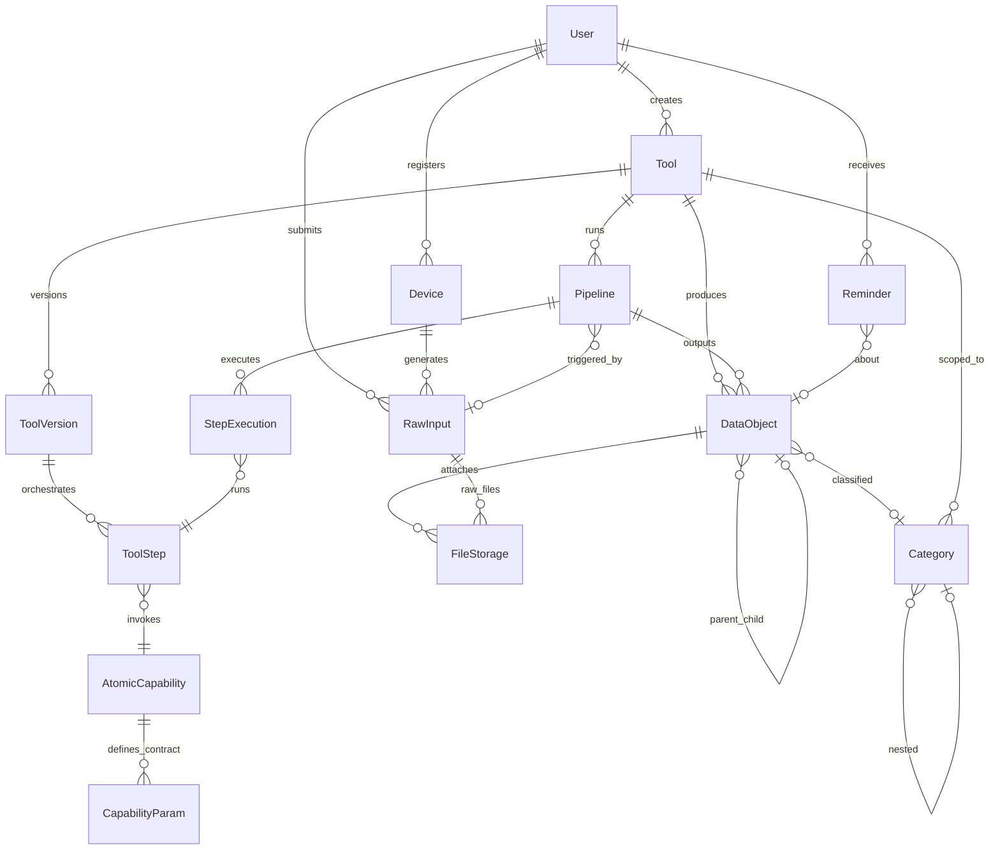

# M1 ERD 裁剪设计

> Version: 1.1 | Date: 2026-03-10 | Status: Approved (updated after M1 completion)
>
> 基于 erd.md v0.4，针对 M1 骨架验证里程碑进行实体裁剪。

---

## 1. M1 范围回顾

源自 PRD：

- **Scope**：Server + REST API + Web Client + Todo List（预置工具）+ 证件管理（第二场景验证）
- **验证点**：Todo 端到端完成；手动注册证件管理时零代码变更
- **排除项**：Desktop/Mobile/Plugin 客户端、LLM 动态生成、模板市场、跨用户共享、用户记忆、主动建议

---

## 2. 裁剪决策

从 erd.md 的 22 个实体中保留 14 个，推迟 8 个。

### 2.1 保留实体（14 个）

| 域 | 实体 | 数量 |
|----|------|------|
| 横切 Identity | User, Device | 2 |
| Capability | AtomicCapability, CapabilityParam | 2 |
| Data | DataObject, FileStorage, Category | 3 |
| Tool | Tool, ToolVersion, ToolStep, RawInput, Pipeline, StepExecution | 6 |
| Intelligence | Reminder | 1 |

### 2.2 推迟实体（8 个）

| 实体 | 推迟原因 | 回归里程碑 |
|------|----------|-----------|
| Tag, EntityTag | M1 只用 Category 做分类 | M2 |
| ToolRelation | 无工具演化需求 | M3 |
| TemplateMarket | M1 明确排除 | M3 |
| HumanReview | M1 无 LLM，不存在审核 LLM 输出的场景 | M3 |
| UserMemory | M1 明确排除 | M4 |
| Suggestion | M1 明确排除 | M4 |
| FeedbackLog | M1 明确排除 | M4 |

### 2.3 裁剪原则

- Reminder 从 Intelligence 域单独保留，因为 Todo 到期提醒和证件过期提醒是 M1 核心体验
- StepExecution 保留，因为证件管理的 OCR 管道需要每步执行状态可追踪
- Device 保留，虽然 M1 只有 Web Client，但表结构简单且为 RawInput 提供来源标记
- 被砍掉的 8 个实体全部属于 M1 明确排除的功能范围，后续加入不需要改动已有表结构

---

## 3. M1 实体关系图

---

## 4. 各实体 M1 职责

### 4.1 横切 · Identity

| 实体 | M1 职责 | 备注 |
|------|---------|------|
| **User** | 单用户，认证 + 偏好 | 预留多用户字段但 M1 不实现权限模型 |
| **Device** | 仅注册 Web Client 一个设备 | 为 RawInput 提供来源标记 |

### 4.2 Capability 域

| 实体 | M1 职责 | 备注 |
|------|---------|------|
| **AtomicCapability** | 注册 M1 预置原子能力 | 运行时类型：`builtin`、`remote_llm`、`script`（script M1 未实现） |
| **CapabilityParam** | 定义每个原子能力的输入输出契约 | 不变 |

M1 预置原子能力（7 个）：

- 采集类：`text_input`、`image_upload`（builtin）
- 处理类：`todo_parse`（remote_llm, Gemini 3.1 Pro, mode=text）、`ocr_extract`（remote_llm, Gemini 3.1 Pro, mode=vision）、`image_process`（remote_llm, Gemini 3.1 Flash Image, mode=image_generation）
- 存储类：`data_object_write`（builtin）
- 使用类：`reminder_schedule`（builtin）

**LLM 模型选择：**
- **Gemini 3.1 Pro** — 文本理解和视觉任务（todo 解析、证件 OCR）
- **Gemini 3.1 Flash Image** — 图像生成/处理（证件图片标准化：对比度增强、裁剪矫正）
- 通过 Google AI Studio API 调用，`?key=API_KEY` 认证

### 4.3 Data 域

| 实体 | M1 职责 | 备注 |
|------|---------|------|
| **DataObject** | Todo 项和证件记录统一存储 | `attributes` 结构由 Tool.data_schema 约束 |
| **FileStorage** | 证件原图、标准化后证件图的文件引用 | Todo 场景暂不用 |
| **Category** | 证件按类别组织（身份证/护照/驾照） | `tool_id` 隔离，Todo 可选用 |

### 4.4 Tool 域 — 定义层

| 实体 | M1 职责 | 备注 |
|------|---------|------|
| **Tool** | 预置 Todo 和证件管理两个工具 | `source = system`，`status = active` |
| **ToolVersion** | 每个预置工具一个初始版本 | M1 无演化，版本固定 |
| **ToolStep** | 定义每个工具的处理步骤编排 | Todo 4 步，证件 5 步（含图片标准化） |

**证件管理 Pipeline（5 步）：**
1. `image_upload` (builtin) — 捕获原始证件图片
2. `ocr_extract` (Gemini 3.1 Pro, vision) — 提取证件类型、号码、姓名、有效期、签发国
3. `image_process` (Gemini 3.1 Flash Image, image_generation) — 对比度增强 + 裁剪矫正 → 标准证件图
4. `data_object_write` (builtin) — 持久化结构化数据 + 处理后图片引用
5. `reminder_schedule` (builtin) — 根据有效期创建过期提醒

**Todo List Pipeline（4 步）：**
1. `text_input` (builtin) — 捕获用户文本
2. `todo_parse` (Gemini 3.1 Pro, text) — 提取标题、描述、截止日期、优先级
3. `data_object_write` (builtin) — 持久化结构化数据
4. `reminder_schedule` (builtin) — 根据截止日期创建提醒

### 4.5 Tool 域 — 执行层

| 实体 | M1 职责 | 备注 |
|------|---------|------|
| **RawInput** | 接收 Web 端提交的原始数据 | Todo 是文本，证件是图片 |
| **Pipeline** | 每次数据提交创建一个执行实例 | 关联 Tool + ToolVersion + RawInput |
| **StepExecution** | 记录管道每步的执行状态 | 证件 OCR 成功/失败可追踪 |

### 4.6 Intelligence 域（仅 Reminder）

| 实体 | M1 职责 | 备注 |
|------|---------|------|
| **Reminder** | Todo 到期提醒、证件过期提醒 | 关联 DataObject，支持触发时间和重复规则 |

---

## 5. 与原 ERD 的关系

本文档是 erd.md v0.4 的 M1 裁剪视图，不替代原文档。原 ERD 的域架构、依赖规则、ADR 决策全部保持有效。本文档仅定义 M1 实施范围。
