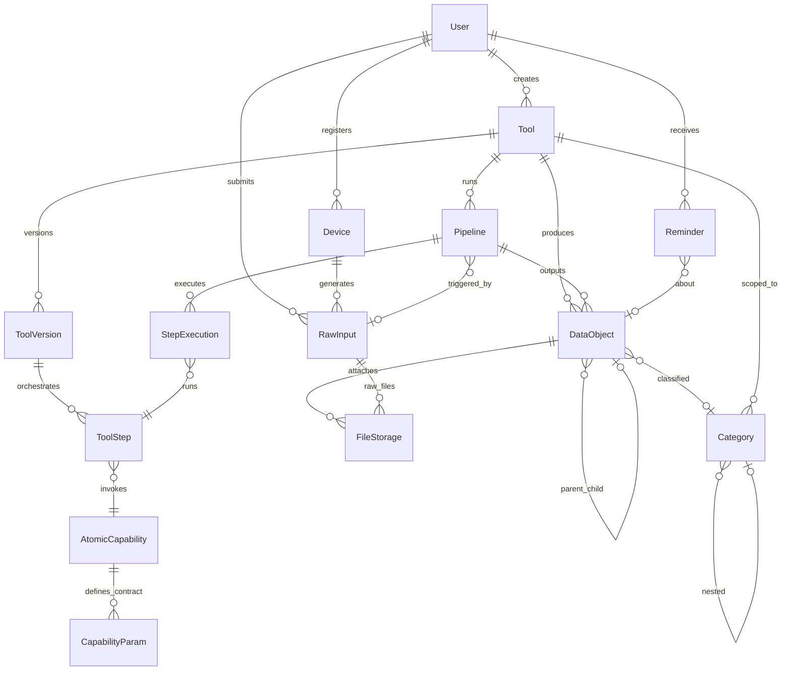

# Lifly — 技术设计文档 (TDD)

> Version: 0.1 | Date: 2026-03-09 | Status: Draft
>
> 本文档为 M1 里程碑的技术设计，涵盖技术选型、系统架构、数据架构、字段级设计、API 设计、数据流、测试策略、开发规划与部署方案。

---

## 1. 技术选型

| 项 | 选型 | 理由 |
|----|------|------|
| 后端语言 | **Rust** | 性能好、类型安全、部署为单二进制 |
| Web 框架 | **Axum** | Tokio 官方维护，类型驱动设计，社区活跃度最高 |
| 数据库 | **PostgreSQL + pgvector** | 关系型 + JSONB + 向量检索一站式满足 |
| 数据库交互 | **SQLx** | 编译期 SQL 校验，零抽象开销，对 JSONB/pgvector 友好 |
| 前端框架 | **React** | 生态最大，组件丰富 |
| 前端包管理 | **pnpm** | 快速，严格依赖管理，成熟稳定 |
| 部署 | **docker-compose** | 一键部署，Server + DB 两个容器 |
| CI | **GitHub Actions** | 每次 push 自动跑全量测试 |

---

## 2. 系统架构

### 2.1 部署拓扑

```
┌─────────────────────────────────────────────┐
│              docker-compose                  │
│                                              │
│  ┌────────────────────────┐  ┌────────────┐ │
│  │        server          │  │     db     │ │
│  │                        │  │            │ │
│  │  ┌──────────────────┐  │  │ PostgreSQL │ │
│  │  │  Axum            │  │  │ + pgvector │ │
│  │  │  ├─ REST API     │──┼──│            │ │
│  │  │  ├─ WebSocket    │  │  └────────────┘ │
│  │  │  └─ Static Files │  │                 │
│  │  └──────────────────┘  │                 │
│  └────────────────────────┘                 │
│                                              │
│  Volumes:                                    │
│  ├─ db_data (PostgreSQL 数据)                │
│  └─ file_storage (用户上传文件)              │
└──────────────┬──────────────────────────────┘
               │
            Web Client
            (浏览器访问)
               │
         ┌─────┴─────┐
         │ Remote LLM │
         │ API        │
         └────────────┘
```

### 2.2 模块划分

顶层按域分，域内按技术层分：

```
src/
├── identity/
│   ├── handlers.rs      # HTTP 路由处理
│   ├── service.rs       # 业务逻辑
│   ├── repo.rs          # 数据库操作
│   └── models.rs        # 数据模型
├── capability/
│   ├── handlers.rs
│   ├── service.rs
│   ├── repo.rs
│   └── models.rs
├── data/
│   ├── handlers.rs
│   ├── service.rs
│   ├── repo.rs
│   └── models.rs
├── tool/
│   ├── handlers.rs
│   ├── service.rs
│   ├── repo.rs
│   ├── models.rs
│   └── pipeline/        # Pipeline 执行引擎
│       ├── engine.rs
│       ├── executor.rs
│       └── mod.rs
├── intelligence/
│   ├── handlers.rs
│   ├── service.rs
│   ├── repo.rs
│   └── models.rs
├── common/
│   ├── error.rs         # 统一错误处理
│   ├── response.rs      # 统一响应格式
│   ├── config.rs        # 配置管理
│   ├── middleware.rs     # 中间件（认证、日志等）
│   └── ws.rs            # WebSocket 管理
└── main.rs
```

### 2.3 通信方式

| 通信 | 用途 |
|------|------|
| **REST API** | 所有 CRUD 操作 |
| **WebSocket** | Pipeline 执行状态推送、Reminder 提醒通知 |

---

## 3. 数据架构

> 完整数据架构见 `erd.md`。本章为 M1 裁剪版。

### 3.1 M1 域架构

系统数据模型划分为四个域 + 一个横切关注点：

```
        User · Device ── 横切（身份与接入）
 ═══════════════════════════════════════════
  ┌──────────────┐
  │     Tool     │
  │   组装·执行   │
  │              │        ┌──────────────┐
  │ Tool         │        │ Intelligence │
  │ ToolVersion  │        │   (仅提醒)    │
  │ ToolStep     │        │              │
  │ RawInput     │        │ Reminder     │
  │ Pipeline     │        └──────────────┘
  │ StepExecution│
  └───┬──────────┘
      │
 ─────┼──────────────────────────────────
      │
      ▼
  ┌──────────────┐         ┌──────────────┐
  │  Capability  │         │     Data     │
  │              │         │              │
  │ Atomic       │         │ DataObject   │
  │  Capability  │         │ FileStorage  │
  │ Capability   │         │ Category     │
  │  Param       │         └──────────────┘
  └──────────────┘
```

### 3.2 依赖规则

```
Intelligence ──→ Data
Tool ──→ Capability, Data
Data ──→ (无)
Capability ──→ (无)
User/Device ··→ 横切，所有域可引用
```

### 3.3 M1 实体清单（14 个）

| 域 | 实体 | 数量 |
|----|------|------|
| 横切 Identity | User, Device | 2 |
| Capability | AtomicCapability, CapabilityParam | 2 |
| Data | DataObject, FileStorage, Category | 3 |
| Tool | Tool, ToolVersion, ToolStep, RawInput, Pipeline, StepExecution | 6 |
| Intelligence | Reminder | 1 |

### 3.4 推迟实体（8 个）

| 实体 | 推迟原因 | 回归里程碑 |
|------|----------|-----------|
| Tag, EntityTag | M1 只用 Category | M2 |
| ToolRelation | 无工具演化需求 | M3 |
| TemplateMarket | M1 明确排除 | M3 |
| HumanReview | M1 无 LLM 审核场景 | M3 |
| UserMemory | M1 明确排除 | M4 |
| Suggestion | M1 明确排除 | M4 |
| FeedbackLog | M1 明确排除 | M4 |

### 3.5 M1 实体关系图



### 3.6 关键设计决策

#### ADR-1：DataObject + JSONB vs 每场景专用表

**决策**：统一的 DataObject 表 + JSONB attributes。

**理由**：系统意图驱动，工具由 LLM 动态生成，无法预知场景。统一容器使得新工具无需 DDL 变更，且所有数据天然共享标签、分类、向量检索能力。

**代价**：JSONB 字段无法建传统 B-tree 索引（用 GIN + 表达式索引缓解）；需应用层做 schema 校验。

#### ADR-2：data_schema 机制

Tool 通过 `data_schema`（JSON Schema 格式）声明其 DataObject 的属性结构。LLM 生成工具时同时生成 schema，Pipeline 写入时自动校验。版本演化时 schema 随 ToolVersion 快照。

#### ADR-3：向量检索

DataObject 统一携带 `vector_embedding` 字段（pgvector）。所有业务数据共享同一向量空间，天然支持跨工具语义搜索。

#### ADR-4：文件与元数据分离

二进制文件存文件系统，数据库仅存 FileStorage 引用（路径、校验和等）。DataObject 通过外键关联 FileStorage。

#### ADR-5：本地/远程 LLM 共存

AtomicCapability 区分运行时类型。M1 支持 `builtin`、`script`、`remote_llm` 三种。`remote_llm` 在 `runtime_config` 中配置脱敏策略。未来端侧模型成熟后，可将 remote 逐步切换为 local，对上层透明。

#### ADR-6：域架构而非线性分层

采用四域模型 + 横切身份层。Tool 和 Intelligence 是平级的消费者，都依赖 Capability 和 Data 两个基座域。

---

## 4. 字段级设计

### 4.1 横切 · Identity

#### User

| 字段 | 类型 | 约束 | 说明 |
|------|------|------|------|
| id | UUID | PK | 主键 |
| username | VARCHAR(64) | UNIQUE, NOT NULL | 用户名 |
| password_hash | VARCHAR(256) | NOT NULL | 密码哈希 |
| display_name | VARCHAR(128) | | 显示名称 |
| preferences | JSONB | DEFAULT '{}' | 用户偏好设置 |
| created_at | TIMESTAMPTZ | NOT NULL, DEFAULT now() | 创建时间 |
| updated_at | TIMESTAMPTZ | NOT NULL, DEFAULT now() | 更新时间 |

#### Device

| 字段 | 类型 | 约束 | 说明 |
|------|------|------|------|
| id | UUID | PK | 主键 |
| user_id | UUID | FK → User, NOT NULL | 所属用户 |
| name | VARCHAR(128) | NOT NULL | 设备名称 |
| device_type | VARCHAR(16) | NOT NULL | 类型：web / desktop / mobile / plugin |
| platform | VARCHAR(64) | | 平台信息（如 Chrome 122, macOS） |
| token | VARCHAR(512) | UNIQUE | 设备令牌 |
| is_active | BOOLEAN | NOT NULL, DEFAULT true | 是否活跃 |
| last_seen_at | TIMESTAMPTZ | | 最后活跃时间 |
| created_at | TIMESTAMPTZ | NOT NULL, DEFAULT now() | 创建时间 |
| updated_at | TIMESTAMPTZ | NOT NULL, DEFAULT now() | 更新时间 |

**索引**：`device(user_id)`

### 4.2 Capability 域

#### AtomicCapability

| 字段 | 类型 | 约束 | 说明 |
|------|------|------|------|
| id | UUID | PK | 主键 |
| name | VARCHAR(128) | UNIQUE, NOT NULL | 能力名称（如 text_input, ocr_extract） |
| description | TEXT | | 能力描述 |
| category | VARCHAR(16) | NOT NULL | 类别：collect / process / store / use |
| runtime_type | VARCHAR(16) | NOT NULL | 运行时：builtin / script / remote_llm |
| runtime_config | JSONB | DEFAULT '{}' | 运行时配置（API 地址、脱敏策略等） |
| is_active | BOOLEAN | NOT NULL, DEFAULT true | 是否启用 |
| created_at | TIMESTAMPTZ | NOT NULL, DEFAULT now() | 创建时间 |
| updated_at | TIMESTAMPTZ | NOT NULL, DEFAULT now() | 更新时间 |

**索引**：`atomic_capability(category)`, `atomic_capability(runtime_type)`

#### CapabilityParam

| 字段 | 类型 | 约束 | 说明 |
|------|------|------|------|
| id | UUID | PK | 主键 |
| capability_id | UUID | FK → AtomicCapability, NOT NULL | 所属能力 |
| name | VARCHAR(128) | NOT NULL | 参数名 |
| direction | VARCHAR(8) | NOT NULL | 方向：input / output |
| data_type | VARCHAR(32) | NOT NULL | 数据类型（string / number / boolean / json / file） |
| is_required | BOOLEAN | NOT NULL, DEFAULT false | 是否必填 |
| default_value | JSONB | | 默认值 |
| description | TEXT | | 参数描述 |
| created_at | TIMESTAMPTZ | NOT NULL, DEFAULT now() | 创建时间 |

**索引**：`capability_param(capability_id)`
**唯一约束**：`(capability_id, name, direction)`

### 4.3 Data 域

#### DataObject

| 字段 | 类型 | 约束 | 说明 |
|------|------|------|------|
| id | UUID | PK | 主键 |
| tool_id | UUID | FK → Tool, NOT NULL | 归属工具 |
| pipeline_id | UUID | FK → Pipeline | 产出该对象的管道实例 |
| parent_id | UUID | FK → DataObject (self) | 父对象（树形结构） |
| category_id | UUID | FK → Category | 分类 |
| attributes | JSONB | NOT NULL, DEFAULT '{}' | 动态属性，结构由 Tool.data_schema 约束 |
| vector_embedding | vector(1536) | | 语义向量（pgvector），维度随 embedding 模型定 |
| status | VARCHAR(16) | NOT NULL, DEFAULT 'active' | 状态：active / archived / deleted |
| created_at | TIMESTAMPTZ | NOT NULL, DEFAULT now() | 创建时间 |
| updated_at | TIMESTAMPTZ | NOT NULL, DEFAULT now() | 更新时间 |

**索引**：
- `data_object(tool_id)`
- `data_object(pipeline_id)`
- `data_object(parent_id)`
- `data_object(category_id)`
- `data_object(status)`
- GIN 索引：`data_object_attributes ON data_object USING GIN (attributes)`
- HNSW 索引：`data_object_embedding ON data_object USING hnsw (vector_embedding vector_cosine_ops)`

#### FileStorage

| 字段 | 类型 | 约束 | 说明 |
|------|------|------|------|
| id | UUID | PK | 主键 |
| data_object_id | UUID | FK → DataObject | 关联的数据对象 |
| raw_input_id | UUID | FK → RawInput | 关联的原始输入 |
| file_path | VARCHAR(512) | NOT NULL | 文件系统相对路径 |
| file_name | VARCHAR(256) | NOT NULL | 原始文件名 |
| mime_type | VARCHAR(128) | NOT NULL | MIME 类型 |
| file_size | BIGINT | NOT NULL | 文件大小（字节） |
| checksum | VARCHAR(128) | NOT NULL | SHA-256 校验和 |
| role | VARCHAR(16) | NOT NULL, DEFAULT 'original' | 角色：original / thumbnail / processed |
| created_at | TIMESTAMPTZ | NOT NULL, DEFAULT now() | 创建时间 |

**索引**：`file_storage(data_object_id)`, `file_storage(raw_input_id)`

#### Category

| 字段 | 类型 | 约束 | 说明 |
|------|------|------|------|
| id | UUID | PK | 主键 |
| tool_id | UUID | FK → Tool, NOT NULL | 所属工具（按工具隔离） |
| parent_id | UUID | FK → Category (self) | 父分类（树形结构） |
| name | VARCHAR(128) | NOT NULL | 分类名称 |
| sort_order | INT | NOT NULL, DEFAULT 0 | 排序 |
| created_at | TIMESTAMPTZ | NOT NULL, DEFAULT now() | 创建时间 |
| updated_at | TIMESTAMPTZ | NOT NULL, DEFAULT now() | 更新时间 |

**索引**：`category(tool_id)`, `category(parent_id)`
**唯一约束**：`(tool_id, parent_id, name)`

### 4.4 Tool 域 — 定义层

#### Tool

| 字段 | 类型 | 约束 | 说明 |
|------|------|------|------|
| id | UUID | PK | 主键 |
| user_id | UUID | FK → User, NOT NULL | 创建者 |
| name | VARCHAR(128) | NOT NULL | 工具名称 |
| description | TEXT | | 工具描述 |
| source | VARCHAR(16) | NOT NULL | 来源：system / llm_generated / evolved / shared |
| status | VARCHAR(16) | NOT NULL, DEFAULT 'draft' | 状态：draft / sandbox / active / archived |
| data_schema | JSONB | | JSON Schema 格式，定义 DataObject 属性结构 |
| trigger_config | JSONB | DEFAULT '{}' | 触发配置 |
| current_version_id | UUID | FK → ToolVersion | 当前活跃版本 |
| created_at | TIMESTAMPTZ | NOT NULL, DEFAULT now() | 创建时间 |
| updated_at | TIMESTAMPTZ | NOT NULL, DEFAULT now() | 更新时间 |

**索引**：`tool(user_id)`, `tool(status)`

#### ToolVersion

| 字段 | 类型 | 约束 | 说明 |
|------|------|------|------|
| id | UUID | PK | 主键 |
| tool_id | UUID | FK → Tool, NOT NULL | 所属工具 |
| version_number | INT | NOT NULL | 版本号（递增） |
| change_log | TEXT | | 变更说明 |
| data_schema_snapshot | JSONB | | data_schema 快照 |
| creator_type | VARCHAR(16) | NOT NULL | 创建者类型：human / llm / evolution |
| created_at | TIMESTAMPTZ | NOT NULL, DEFAULT now() | 创建时间 |

**索引**：`tool_version(tool_id)`
**唯一约束**：`(tool_id, version_number)`

#### ToolStep

| 字段 | 类型 | 约束 | 说明 |
|------|------|------|------|
| id | UUID | PK | 主键 |
| tool_version_id | UUID | FK → ToolVersion, NOT NULL | 所属版本 |
| capability_id | UUID | FK → AtomicCapability, NOT NULL | 调用的原子能力 |
| step_order | INT | NOT NULL | 执行顺序 |
| input_mapping | JSONB | DEFAULT '{}' | 输入映射（上一步输出 → 本步输入） |
| output_mapping | JSONB | DEFAULT '{}' | 输出映射 |
| condition | JSONB | | 条件逻辑（满足条件才执行） |
| on_failure | VARCHAR(16) | NOT NULL, DEFAULT 'abort' | 失败策略：abort / skip / retry |
| retry_count | INT | NOT NULL, DEFAULT 0 | 重试次数 |
| created_at | TIMESTAMPTZ | NOT NULL, DEFAULT now() | 创建时间 |

**索引**：`tool_step(tool_version_id)`
**唯一约束**：`(tool_version_id, step_order)`

### 4.5 Tool 域 — 执行层

#### RawInput

| 字段 | 类型 | 约束 | 说明 |
|------|------|------|------|
| id | UUID | PK | 主键 |
| user_id | UUID | FK → User, NOT NULL | 提交用户 |
| device_id | UUID | FK → Device | 来源设备 |
| input_type | VARCHAR(16) | NOT NULL | 输入类型：text / image / audio / video / url |
| raw_content | TEXT | | 原始文本内容（文本类型时使用） |
| metadata | JSONB | DEFAULT '{}' | 采集元数据（GPS、时间、设备信息等） |
| processing_status | VARCHAR(16) | NOT NULL, DEFAULT 'pending' | 处理状态：pending / processing / completed / failed |
| created_at | TIMESTAMPTZ | NOT NULL, DEFAULT now() | 创建时间 |
| updated_at | TIMESTAMPTZ | NOT NULL, DEFAULT now() | 更新时间 |

**索引**：`raw_input(user_id)`, `raw_input(device_id)`, `raw_input(processing_status)`

#### Pipeline

| 字段 | 类型 | 约束 | 说明 |
|------|------|------|------|
| id | UUID | PK | 主键 |
| tool_id | UUID | FK → Tool, NOT NULL | 关联工具 |
| tool_version_id | UUID | FK → ToolVersion, NOT NULL | 关联版本 |
| raw_input_id | UUID | FK → RawInput | 触发的原始输入 |
| status | VARCHAR(16) | NOT NULL, DEFAULT 'pending' | 状态：pending / running / completed / failed |
| context | JSONB | DEFAULT '{}' | 运行上下文（步骤间传递的数据） |
| started_at | TIMESTAMPTZ | | 开始时间 |
| completed_at | TIMESTAMPTZ | | 完成时间 |
| error_message | TEXT | | 错误信息 |
| created_at | TIMESTAMPTZ | NOT NULL, DEFAULT now() | 创建时间 |

**索引**：`pipeline(tool_id)`, `pipeline(raw_input_id)`, `pipeline(status)`

#### StepExecution

| 字段 | 类型 | 约束 | 说明 |
|------|------|------|------|
| id | UUID | PK | 主键 |
| pipeline_id | UUID | FK → Pipeline, NOT NULL | 所属管道 |
| tool_step_id | UUID | FK → ToolStep, NOT NULL | 关联步骤定义 |
| status | VARCHAR(16) | NOT NULL, DEFAULT 'pending' | 状态：pending / running / completed / failed / skipped |
| actual_input | JSONB | | 实际输入 |
| actual_output | JSONB | | 实际输出 |
| started_at | TIMESTAMPTZ | | 开始时间 |
| completed_at | TIMESTAMPTZ | | 完成时间 |
| duration_ms | INT | | 执行耗时（毫秒） |
| error_message | TEXT | | 错误信息 |
| created_at | TIMESTAMPTZ | NOT NULL, DEFAULT now() | 创建时间 |

**索引**：`step_execution(pipeline_id)`, `step_execution(status)`

### 4.6 Intelligence 域

#### Reminder

| 字段 | 类型 | 约束 | 说明 |
|------|------|------|------|
| id | UUID | PK | 主键 |
| user_id | UUID | FK → User, NOT NULL | 所属用户 |
| data_object_id | UUID | FK → DataObject | 关联的数据对象 |
| title | VARCHAR(256) | NOT NULL | 提醒标题 |
| description | TEXT | | 提醒描述 |
| trigger_at | TIMESTAMPTZ | NOT NULL | 触发时间 |
| repeat_rule | JSONB | | 重复规则（如 {"type": "daily", "interval": 1}） |
| status | VARCHAR(16) | NOT NULL, DEFAULT 'pending' | 状态：pending / triggered / dismissed / cancelled |
| created_at | TIMESTAMPTZ | NOT NULL, DEFAULT now() | 创建时间 |
| updated_at | TIMESTAMPTZ | NOT NULL, DEFAULT now() | 更新时间 |

**索引**：`reminder(user_id)`, `reminder(data_object_id)`, `reminder(trigger_at, status)`

---

## 5. API 设计

### 5.1 设计原则

- **混合路由风格**：有明确归属的资源用嵌套路由，跨父级查询用扁平路由
- **统一响应格式**：所有接口返回统一包装

```json
{
  "code": 0,
  "data": { ... },
  "message": "ok"
}
```

错误响应：

```json
{
  "code": 40001,
  "data": null,
  "message": "Validation failed: title is required"
}
```

### 5.2 API 端点

#### Identity

| 方法 | 路径 | 说明 |
|------|------|------|
| POST | `/api/auth/login` | 登录 |
| POST | `/api/auth/logout` | 登出 |
| GET | `/api/user/profile` | 获取用户信息 |
| PUT | `/api/user/profile` | 更新用户信息 |
| GET | `/api/user/devices` | 获取设备列表 |
| POST | `/api/user/devices` | 注册设备 |

#### Capability

| 方法 | 路径 | 说明 |
|------|------|------|
| GET | `/api/capabilities` | 获取能力列表 |
| GET | `/api/capabilities/{id}` | 获取能力详情（含参数） |

M1 能力为系统预置，不提供创建/修改 API。

#### Tool

| 方法 | 路径 | 说明 |
|------|------|------|
| GET | `/api/tools` | 获取工具列表 |
| GET | `/api/tools/{id}` | 获取工具详情 |
| GET | `/api/tools/{id}/versions` | 获取工具版本列表 |
| GET | `/api/tools/{id}/versions/{vid}` | 获取版本详情（含步骤） |
| GET | `/api/tools/{id}/categories` | 获取工具分类树 |
| POST | `/api/tools/{id}/categories` | 创建分类 |
| PUT | `/api/tools/{id}/categories/{cid}` | 更新分类 |
| DELETE | `/api/tools/{id}/categories/{cid}` | 删除分类 |

M1 工具为系统预置，不提供工具创建/修改 API。

#### Data

| 方法 | 路径 | 说明 |
|------|------|------|
| GET | `/api/data-objects` | 查询数据对象（支持 tool_id、category_id、status 过滤） |
| GET | `/api/data-objects/{id}` | 获取数据对象详情 |
| PUT | `/api/data-objects/{id}` | 更新数据对象 |
| DELETE | `/api/data-objects/{id}` | 删除数据对象（软删除） |
| GET | `/api/data-objects/{id}/files` | 获取关联文件列表 |
| GET | `/api/data-objects/search` | 语义搜索（向量检索） |

DataObject 由 Pipeline 自动产出，不提供手动创建 API。

#### Pipeline（执行）

| 方法 | 路径 | 说明 |
|------|------|------|
| POST | `/api/raw-inputs` | 提交原始输入（触发 Pipeline） |
| GET | `/api/raw-inputs/{id}` | 获取原始输入详情 |
| GET | `/api/pipelines` | 查询管道执行列表 |
| GET | `/api/pipelines/{id}` | 获取管道执行详情（含各步状态） |

#### Intelligence（Reminder）

| 方法 | 路径 | 说明 |
|------|------|------|
| GET | `/api/reminders` | 获取提醒列表（支持状态过滤） |
| GET | `/api/reminders/{id}` | 获取提醒详情 |
| POST | `/api/reminders` | 手动创建提醒 |
| PUT | `/api/reminders/{id}` | 更新提醒 |
| DELETE | `/api/reminders/{id}` | 删除提醒 |
| POST | `/api/reminders/{id}/dismiss` | 关闭提醒 |

#### WebSocket

| 端点 | 说明 |
|------|------|
| `ws://host/ws` | 统一 WebSocket 连接 |

推送消息类型：

```json
{"type": "pipeline.status", "data": {"pipeline_id": "...", "status": "running", "step": 2}}
{"type": "reminder.trigger", "data": {"reminder_id": "...", "title": "..."}}
```

#### 文件上传/下载

| 方法 | 路径 | 说明 |
|------|------|------|
| POST | `/api/files/upload` | 上传文件（multipart/form-data） |
| GET | `/api/files/{id}` | 下载/预览文件 |

---

## 6. 数据流

### 6.1 Todo 场景

```
用户在 Web 输入 "明天下午3点开会讨论项目方案"
    │
    ▼
POST /api/raw-inputs
    { input_type: "text", raw_content: "明天下午3点开会讨论项目方案" }
    │
    ▼
创建 RawInput (processing_status: pending)
    │
    ▼
创建 Pipeline (tool: Todo, status: running)
    │
    ├─→ StepExecution #1: text_input [builtin]
    │       采集原始文本，输出 raw_content
    │
    ├─→ StepExecution #2: todo_parse [remote_llm]
    │       LLM 识别结构化信息：
    │       {
    │           "title": "开会讨论项目方案",
    │           "due_date": "2026-03-10T15:00:00+08:00",
    │           "priority": "normal",
    │           "category": "工作"
    │       }
    │
    ├─→ StepExecution #3: data_object_write [builtin]
    │       创建 DataObject，attributes 写入上述结构化数据
    │
    └─→ StepExecution #4: reminder_schedule [builtin]
            检测到 due_date，创建 Reminder (trigger_at: 2026-03-10T15:00:00)
    │
    ▼
Pipeline 完成 (status: completed)
WebSocket 推送 pipeline.status → 前端刷新
```

### 6.2 证件管理场景

```
用户在 Web 上传护照照片
    │
    ▼
POST /api/files/upload → FileStorage (role: original)
POST /api/raw-inputs
    { input_type: "image", raw_input_id关联FileStorage }
    │
    ▼
创建 RawInput (processing_status: pending)
    │
    ▼
创建 Pipeline (tool: 证件管理, status: running)
    │
    ├─→ StepExecution #1: image_upload [builtin]
    │       采集图片引用，输出 file_storage_id
    │
    ├─→ StepExecution #2: ocr_extract [remote_llm]
    │       LLM 识别证件信息：
    │       {
    │           "cert_type": "passport",
    │           "cert_number": "E12345678",
    │           "full_name": "张三",
    │           "expiry_date": "2030-06-15",
    │           "issuing_country": "CN"
    │       }
    │
    ├─→ StepExecution #3: data_object_write [builtin]
    │       创建 DataObject，attributes 写入上述结构化数据
    │       关联 FileStorage 和 Category(护照)
    │
    └─→ StepExecution #4: reminder_schedule [builtin]
            检测到 expiry_date，创建 Reminder (trigger_at: 2030-05-15，提前一个月提醒)
    │
    ▼
Pipeline 完成 (status: completed)
WebSocket 推送 pipeline.status → 前端刷新
```

### 6.3 数据流通用模式

所有场景遵循相同的执行模式：

```
客户端提交 → RawInput → Pipeline → [StepExecution...] → DataObject + Reminder(可选)
```

新增场景时只需：
1. 注册新的 Tool + ToolVersion + ToolStep
2. 定义 data_schema
3. 按需注册新的 AtomicCapability

无需修改代码或数据库结构。

---

## 7. 测试策略

### 7.1 测试分层

| 层 | 工具 | 覆盖重点 | 运行时机 |
|----|------|----------|----------|
| 后端单元测试 | Rust `#[test]` | Pipeline 编排逻辑、LLM 响应解析、data_schema 校验、输入输出映射 | 每次 push |
| 后端集成测试 | testcontainers + PostgreSQL | 每个 API 端点 + 数据库交互、Pipeline 端到端执行 | 每次 push |
| 前端组件测试 | React Testing Library + MSW | 关键交互组件（表单、列表、状态展示） | 每次 push |
| E2E 测试 | Playwright | Todo 和证件管理完整用户流程 | 每次 push |

### 7.2 后端测试重点

**单元测试：**
- Pipeline 引擎：步骤编排顺序、条件跳过、失败策略（abort/skip/retry）
- LLM 响应解析：正常响应、异常格式、超时处理
- data_schema 校验：合法/非法 attributes 的校验结果
- 输入输出映射：步骤间数据正确传递

**集成测试：**
- 使用 testcontainers 启动临时 PostgreSQL（含 pgvector 扩展）
- 覆盖所有 API 端点的正常和异常路径
- Pipeline 端到端：提交 RawInput → Pipeline 执行 → DataObject 产出 → Reminder 创建
- JSONB 查询：验证 GIN 索引和表达式索引的查询正确性
- 向量检索：验证 pgvector 的语义搜索功能

### 7.3 前端测试重点

**组件测试（React Testing Library + MSW）：**
- Todo 创建表单提交及验证
- 证件上传流程（文件选择 → 上传 → 进度展示）
- Pipeline 状态实时展示（mock WebSocket 消息）
- 提醒列表渲染和交互（dismiss、编辑）
- 统一响应格式的错误处理展示

### 7.4 E2E 测试重点

**Playwright 场景：**
- Todo 完整流程：输入文本 → 等待 Pipeline 处理 → 查看 DataObject → 验证 Reminder 创建
- 证件管理完整流程：上传照片 → 等待 OCR → 查看证件信息 → 验证过期提醒
- 跨场景验证：两个工具的数据互不干扰

### 7.5 CI 配置

GitHub Actions workflow：

```
on: push

jobs:
  backend-test:
    - 启动 testcontainers PostgreSQL
    - cargo test（单元 + 集成）

  frontend-test:
    - pnpm install
    - pnpm test（组件测试）

  e2e-test:
    needs: [backend-test, frontend-test]
    - docker-compose up（完整环境）
    - pnpm exec playwright test
```

---

## 8. 开发规划

### 8.1 阶段划分

| 阶段 | 内容 | 交付物 | 预估 |
|------|------|--------|------|
| **P1 基础骨架** | 项目脚手架、docker-compose、数据库建表（14 实体）、CI 搭建 | 可构建、可部署、可跑测试的空项目 | — |
| **P2 核心管道** | AtomicCapability 注册、Tool/ToolVersion/ToolStep 定义、Pipeline 执行引擎、DataObject 写入、Reminder 创建 | 管道引擎可执行预置工具的步骤编排 | — |
| **P3 场景验证** | Todo 场景端到端（含 remote_llm 接入）、证件管理场景端到端、语义搜索 | 两个场景 API 层面全部跑通 | — |
| **P4 前端 + 联调** | React 前端开发、REST API + WebSocket 联调、E2E 测试 | M1 完整交付 | — |

### 8.2 P1 基础骨架 — 任务拆解

1. Rust 项目初始化（Cargo workspace）
2. Axum 基础框架搭建（路由、中间件、错误处理、统一响应格式）
3. SQLx 集成 + 数据库迁移脚本（14 张表）
4. docker-compose 编排（server + db）
5. React 项目初始化（pnpm + 基础脚手架）
6. GitHub Actions CI 配置
7. testcontainers 集成测试基础设施

### 8.3 P2 核心管道 — 任务拆解

1. Identity 模块：User 认证、Device 注册
2. Capability 模块：AtomicCapability + CapabilityParam CRUD、预置能力数据 seed
3. Tool 定义模块：Tool + ToolVersion + ToolStep CRUD
4. Data 模块：DataObject + FileStorage + Category CRUD
5. Pipeline 执行引擎：Pipeline 创建、StepExecution 顺序执行、步骤间数据传递、失败处理
6. RawInput 接收 + 触发 Pipeline
7. Reminder 模块：CRUD + 定时触发检查
8. WebSocket 推送：Pipeline 状态变更、Reminder 触发通知
9. 文件上传/下载服务

### 8.4 P3 场景验证 — 任务拆解

1. remote_llm 运行时实现：调用远程 LLM API、响应解析、脱敏策略
2. Todo 工具 seed：注册 Tool + ToolVersion + ToolStep + data_schema
3. Todo 端到端联调：文本输入 → LLM 解析 → DataObject → Reminder
4. 证件管理工具 seed：注册 Tool + ToolVersion + ToolStep + data_schema
5. 证件端到端联调：图片上传 → LLM OCR → DataObject → Reminder
6. 向量检索实现：embedding 生成 + pgvector 语义搜索 API
7. 后端集成测试编写

### 8.5 P4 前端 + 联调 — 任务拆解

1. 通用布局 + 路由 + API 客户端（统一响应处理）
2. 登录页面
3. 工具列表 / 工具首页
4. Todo 场景前端：输入、列表、详情、编辑
5. 证件管理前端：上传、列表、详情、分类筛选
6. Pipeline 状态实时展示（WebSocket）
7. Reminder 列表 + 通知展示
8. 搜索页面（语义搜索）
9. 前端组件测试
10. Playwright E2E 测试

---

## 9. 部署方案

### 9.1 docker-compose 配置

```yaml
version: "3.8"

services:
  server:
    build: .
    ports:
      - "8080:8080"
    environment:
      - DATABASE_URL=postgresql://lifly:lifly@db:5432/lifly
      - FILE_STORAGE_PATH=/data/files
      - LLM_API_KEY=${LLM_API_KEY}
      - LLM_API_URL=${LLM_API_URL}
    volumes:
      - file_storage:/data/files
    depends_on:
      db:
        condition: service_healthy

  db:
    image: pgvector/pgvector:pg16
    environment:
      - POSTGRES_USER=lifly
      - POSTGRES_PASSWORD=lifly
      - POSTGRES_DB=lifly
    volumes:
      - db_data:/var/lib/postgresql/data
    healthcheck:
      test: ["CMD-SHELL", "pg_isready -U lifly"]
      interval: 5s
      timeout: 5s
      retries: 5

volumes:
  db_data:
  file_storage:
```

### 9.2 server Dockerfile

```dockerfile
# 构建阶段
FROM rust:1.76 AS builder
WORKDIR /app
COPY . .
RUN cargo build --release

# 前端构建
FROM node:20 AS frontend
WORKDIR /app
COPY web/ .
RUN corepack enable && pnpm install && pnpm build

# 运行阶段
FROM debian:bookworm-slim
RUN apt-get update && apt-get install -y ca-certificates && rm -rf /var/lib/apt/lists/*
COPY --from=builder /app/target/release/lifly-server /usr/local/bin/
COPY --from=frontend /app/dist /srv/web
ENV STATIC_FILES_PATH=/srv/web
EXPOSE 8080
CMD ["lifly-server"]
```

### 9.3 一键部署

用户只需：

```bash
git clone https://github.com/xxx/lifly.git
cd lifly
cp .env.example .env   # 填入 LLM_API_KEY
docker-compose up -d
```

浏览器访问 `http://localhost:8080` 即可使用。

---

## 10. 与其他文档的关系

| 文档 | 关系 |
|------|------|
| `prd.md` | 本文档的需求来源，所有技术决策可追溯至 PRD |
| `erd.md` | 完整数据架构（22 实体），本文档第 3 章为其 M1 裁剪版 |
| `plans/2026-03-09-m1-erd-trimming-design.md` | M1 裁剪讨论记录 |
